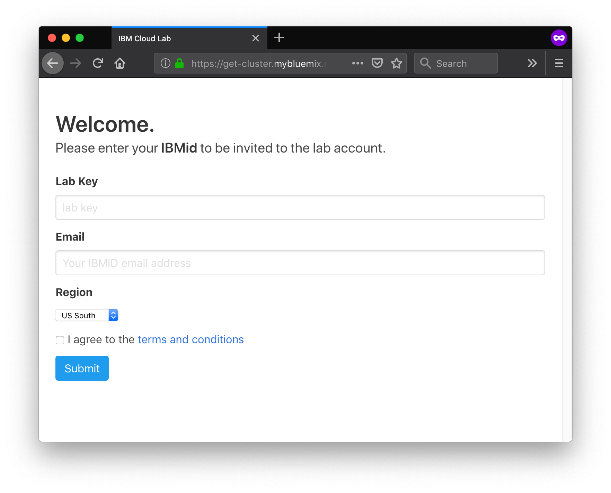

# Setup Steps

These are the prerequisite steps for the Innovate Digital Bank guided workshop.

In this section, you will create your own IBM Cloud account, and then get access to a IBM Cloud Lab account which contains pre-provisioned clusters. Each lab attendee will be granted access to one cluster.

## Create your IBM Cloud account

[Sign up for IBM Cloud](https://ibm.biz/Bd2zDm)

## Get a Kubernetes Cluster

Generally to get started with Kubernetes, the first step is to provision a cluster which can take up to 10 minutes. In addition, free clusters come with limited features and a single worker VM/node. For this workshop, we've created Standard \(paid\) clusters with full Kubernetes functionality.

To get a cluster, head to the Get Cluster\([https://get-cluster.mybluemix.net/](https://get-cluster.mybluemix.net/)\) tool.



Use the key `ibmcloudroadshow` and input the email you used to sign up for IBM Cloud. Ensure that US South is chosen as we've created clusters in the Dallas data center for this lab.

## Install IBM Cloud CLI

You use the [IBM Cloud CLI installer](https://console.bluemix.net/docs/cli/reference/ibmcloud/download_cli.html#install_use) or the OS-specific shell installers below.

* MacOS

  ```bash
  curl -fsSL https://clis.ng.bluemix.net/install/osx | sh
  ```

* Linux

  ```bash
  curl -fsSL https://clis.ng.bluemix.net/install/linux | sh
  ```

* Windows Powershell \(Run as Administrator\)

  ```bash
  iex(New-Object Net.WebClient).DownloadString('https://clis.ng.bluemix.net/install/powershell')
  ```

## Install IBM CLI Plugins

For the lab we will need a few plugins.

* container-service

  ```bash
  ibmcloud plugin install container-service
  ```

* container-registry

  ```bash
  ibmcloud plugin install container-registry
  ```

## Install kubectl tooling

[Install kubectl](https://kubernetes.io/docs/tasks/tools/install-kubectl/) to enable access to your cluster.

* MacOS
  * Homebrew

    ```bash
    brew install kubernetes-cli
    ```

  * MacPorts

    ```bash
    sudo port selfupdate
    sudo port install kubectl
    ```
* Linux
  * Ubuntu, Debian or HypriotOS

    ```bash
    sudo apt-get update && sudo apt-get install -y apt-transport-https
    curl -s https://packages.cloud.google.com/apt/doc/apt-key.gpg | sudo apt-key add -
    echo "deb https://apt.kubernetes.io/ kubernetes-xenial main" | sudo tee -a /etc/apt/sources.list.d/kubernetes.list
    sudo apt-get update
    sudo apt-get install -y kubectl
    ```

  * CentOS, RHEL or Fedora

    ```bash
    cat <<EOF > /etc/yum.repos.d/kubernetes.repo
    [kubernetes]
    name=Kubernetes
    baseurl=https://packages.cloud.google.com/yum/repos/kubernetes-el7-x86_64
    enabled=1
    gpgcheck=1
    repo_gpgcheck=1
    gpgkey=https://packages.cloud.google.com/yum/doc/yum-key.gpg https://packages.cloud.google.com/yum/doc/rpm-package-key.gpg
    EOF
    yum install -y kubectl
    ```

  * Snap

    ```bash
    sudo snap install helm --classic
    ```
* Windows
  * Powershell

    ```bash
    Install-Script -Name install-kubectl -Scope CurrentUser -Force
    install-kubectl.ps1 [-DownloadLocation <path>]
    ```

    > Note ``If you do not specify a `DownloadLocation`, `kubectl` will be installed in the user's temp Directory.``

  * Chocolatey

    ```bash
    choco install kubernetes-helm
    ```

You can also install using [curl](https://kubernetes.io/docs/tasks/tools/install-kubectl/#install-kubectl-binary-using-curl).

Once Kubernetes is installed, test successful installation with,

```bash
kubectl version
```

## Install Helm

[Install Helm for your OS](https://docs.helm.sh/using_helm/#installing-helm)

* MacOS
  * Homebrew

    ```bash
    brew install kubernetes-helm
    ```
* Linux
  * Snap

    ```bash
    sudo snap install helm --classic
    ```
* Windows
  * Chocolatey

    ```bash
    choco install kubernetes-helm
    ```

## Clone the workshop repository

In this step, we'll clone the workshop branch of the repository.

```bash
git clone --single-branch -b workshop https://github.com/moficodes/innovate-digital-bank.git
```

## Next Steps

You've completed the pre-requisite steps to start the lab. In the next steps, you'll deploy the Innovate Digital Bank application to your Kubernetes cluster.

[Get Started on Part 1](lab-1.md)

